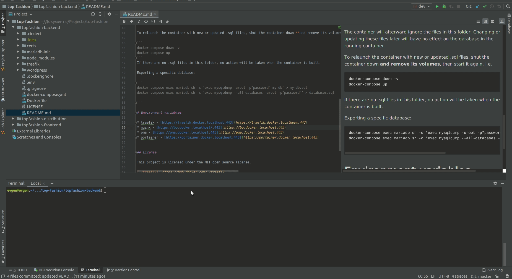

# ⚛ topfashion-frontend

**NOTE**: This is only the frontend part of the application. In order to start the backend part, follow the instructions for the [link](https://github.com/manuelbieh/react-ssr-setup/generate).

**NOTE**: There are many different mistakes in this project, but now I don’t have time to work on fixing it and therefore 
I decided to share it with this project as it is. Maybe someone will come in handy

## DEMO
Frontend:

Backend:

## TOC

- [Motivation](#motivation)
- [Goals](#goals)
- [Features](#features)
- [Installation](#installation)
- [Usage](#usage)

## Motivation

The reason I created this project was because it was possible to try out different technologies of web in a real project,
learn something new, gain experience in a large project where there is a lot of business logic. 
Online shop is an ideal project where you can learn to try out popular tools in web development.

## Goals

My goal is to provide a well-tested, regularly maintained, easily configurable, and customizable React Project with support 
for server-side rendering, which gives you a good foundation for starting your own project.

## Features

This project has out-of-the-box support for the following things:

- General Setup

  - React Fast Refresh (HMR)
  - Babel 7
  - Webpack 4
  - ESLint 6.7 (with a set of custom rules which may be mostly identical to AirBnB with some personal flavor added)
  - TypeScript
  - Prettier
  - ReactIntl for multi language support
  - Server Side Rendering with loadable
  -🏎 React Fast Refresh
  - SCSS
  - Precommit hooks via lint-staged + Husky

- Libs and Dependencies

  - ⚛ React 16.x (latest), with Hooks!
  - ✅ Typescript
  - ✅ Mobx
  - ✅ React Router 5
  - ✅ React Helmet

## Installation

As a general recommendation you should create a **fork** of this project first, add all the dependencies you need and commit 
everything back into your own repository.

Once you've forked the repository here on Github, clone it, `cd` into the directory and run `npm install` on your command 
line to install all the dependencies. You're ready to go now!

## Usage

There are npm scripts for all the relevant things. The server will always be started on port 8449 unless otherwise specified in `HTTPS_PORT`. You can use a `.env` file to specify env vars.

### Noteworthy scripts:

#### `yarn dev`

Starts the app in development mode: creates a new client and server dev build using webpack, starts the Express server build (for both file serving and server side pre-rendering) and keeps webpack open in watchmode. Updates the app (if possible) on change using HMR.

#### `yarn build`

Creates a new build, optimized for production. Does **not** start a dev server or anything else.

#### `yarn lint:code`

Run ESLint for all JavaScript and TypeScript files

#### `yarn lint:style`

Run Stylelint for all CSS files

#### `yarn lint`

Run lint:code and lint:style in parallel
